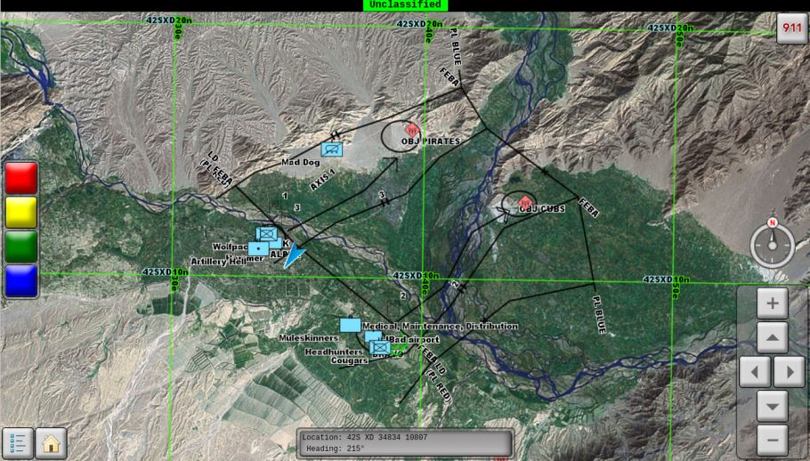

# message-simulator-qt

Message Simulator provides UDP messaging for applications and system components in the ArcGIS for the Military solution, including:

* [Vehicle Commander](https://github.com/Esri/vehicle-commander-java)
* [Squad Leader](https://github.com/Esri/squad-leader-android)
* Custom transports and adapters for ArcGIS GeoEvent Extension for Server ([solutions-geoevent-java](https://github.com/Esri/solutions-geoevent-java))

Note: the Qt version of Vehicle Commander that was in this repo has been retired. If you would like to use that source code, which is no longer supported by Esri, go to [the last commit that included it](https://github.com/Esri/message-simulator-qt/tree/ee7b931565859b34c77d493d4c1333c2424d29e3). It is recommended that you use the current [Vehicle Commander](https://github.com/Esri/vehicle-commander-java) instead.

## Features

* Takes GeoMessage XML files as input
* Writes UDP datagrams as output
* Allows you to adjust throughput and frequency of output
* Includes sample GeoMessage XML files

## Sections

* [Requirements](#requirements)
* [Instructions](#instructions)
* [Resources](#resources)
* [Issues](#issues)
* [Contributing](#contributing)
* [Licensing](#licensing)

## Requirements

* The [Qt software development kit](http://qt.io) with Qt Creator
    * Tested with Qt 5.1.1 and Qt Creator 2.8.1

## Instructions

### General Help

* [New to Github? Get started here.](http://htmlpreview.github.com/?https://github.com/Esri/esri.github.com/blob/master/help/esri-getting-to-know-github.html)

### Getting Started with Message Simulator
#### Building from Source
* Fork and clone this repo.
* Use Qt Creator to open source/ArcGISQtMessageSimulator/ArcGISQtMessageSimulator.pro.
* Run the application and run the simulation with one of the sample message files in source/ArcGISQtMessageSimulator/SampleMessages.
* Confirm that Vehicle Commander or Squad Leader displays the messages. Keep in mind that the computer running Message Simulator and the computer running Vehicle Commander or the device running Squad Leader must be connected to the same router and that router must allow UDP traffic. Alternatively, you could use Qt to develop a simple client app that receives UDP messages, maybe using [QUdpSocket](http://doc.qt.io/qt-5/qudpsocket.html).

#### Binary distributions
If you don't want to build from source, a binary distribution of Message Simulator is available in the 10.2.4 and later binary distributions of Vehicle Commander ([Windows](http://www.arcgis.com/home/item.html?id=ae30551d12f443cb903f4829b03de315), [Linux](http://www.arcgis.com/home/item.html?id=2aa94d8f14374470a2157a3ca4e70413)).

## Resources

* Learn more about Esri's [ArcGIS for the Military solution](http://solutions.arcgis.com/military).

## Issues

Find a bug or want to request a new feature?  Please let us know by submitting an issue.

## Contributing

Esri welcomes contributions from anyone and everyone. Please see our [guidelines for contributing](https://github.com/esri/contributing).

## Licensing

Copyright 2012-2015 Esri

Licensed under the Apache License, Version 2.0 (the "License");
you may not use this file except in compliance with the License.
You may obtain a copy of the License at

   [http://www.apache.org/licenses/LICENSE-2.0](http://www.apache.org/licenses/LICENSE-2.0)

Unless required by applicable law or agreed to in writing, software
distributed under the License is distributed on an "AS IS" BASIS,
WITHOUT WARRANTIES OR CONDITIONS OF ANY KIND, either express or implied.
See the License for the specific language governing permissions and
limitations under the License.

A copy of the license is available in the repository's
[license.txt](license.txt) file.

