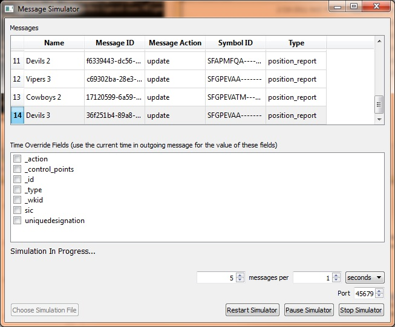

# geomessage-simulator-qt

GeoMessage Simulator provides UDP messaging for applications and system components in the ArcGIS for the Military solution, including:

* Vehicle Commander ([source](https://github.com/Esri/vehicle-commander-java), [binary for Windows](http://www.arcgis.com/home/item.html?id=ae30551d12f443cb903f4829b03de315), [binary for Linux](http://www.arcgis.com/home/item.html?id=2aa94d8f14374470a2157a3ca4e70413))
* Squad Leader ([source](https://github.com/Esri/squad-leader-android), [binary](http://www.arcgis.com/home/item.html?id=2623cc788070408a8bff99bf2ec67f5b))
* GeoMessage Adapter for ArcGIS GeoEvent Extension for Server ([source](https://github.com/Esri/solutions-geoevent-java/blob/master/solutions-geoevent/adapters/geomessage-adapter/README.md), [ArcGIS Online item](http://www.arcgis.com/home/item.html?id=cd3ce7a01fdc46a48aa199bfd091dd50))

Note: the Qt version of Vehicle Commander that was in this repo has been retired. If you would like to use that source code, which is no longer supported by Esri, go to [the 10.2 release](https://github.com/Esri/geomessage-simulator-qt/releases/tag/v10.2) or [the last commit that included Vehicle Commander](https://github.com/Esri/geomessage-simulator-qt/tree/ee7b931565859b34c77d493d4c1333c2424d29e3). It is recommended that you use the current [Vehicle Commander](https://github.com/Esri/vehicle-commander-java) instead.

## Features

* Takes GeoMessage XML files as input. The GeoMessage format is described in the [sample GeoMessage XML files](source/geomessage-simulator/SampleMessages) and also the page for the [GeoMessage Connector for GeoEvent Extension](http://www.arcgis.com/home/item.html?id=cd3ce7a01fdc46a48aa199bfd091dd50).
* Writes UDP broadcast datagrams as output
* Allows you to adjust frequency of output
* Includes sample GeoMessage XML files

## Sections

* [Requirements](#requirements)
* [Instructions](#instructions)
* [Resources](#resources)
* [Issues](#issues)
* [Contributing](#contributing)
* [Licensing](#licensing)

## Requirements

* The [Qt software development kit](http://qt.io) with Qt Creator
    * Tested with Qt 5.1.1 and Qt Creator 2.8.1
* **IMPORTANT**: clients will only receive messages from the GeoMessage Simulator if the machine running GeoMessage Simulator and the machine or device running the client are connected to the same router and that router allows UDP broadcast traffic.

## Instructions

### General Help

* [New to Github? Get started here.](http://htmlpreview.github.com/?https://github.com/Esri/esri.github.com/blob/master/help/esri-getting-to-know-github.html)

### Getting Started with GeoMessage Simulator
#### Building from Source
* Fork and clone this repo.
* Use Qt Creator to open source/geomessage-simulator/geomessage-simulator.pro.
* Run the application and run the simulation with one of the sample message files in source/geomessage-simulator/SampleMessages.
* Confirm that Vehicle Commander or Squad Leader displays the messages. Alternatively, you could use Qt to develop a simple client app that receives UDP messages, maybe using [QUdpSocket](http://doc.qt.io/qt-5/qudpsocket.html). Note the [requirement](#requirements) that the simulator and the client must be able to communicate over UDP for this to work.

#### Binary distributions
If you don't want to build from source, a binary distribution of GeoMessage Simulator is available. (TODO add link when it is posted)

#### Running

##### Graphical mode
Double click the .exe file to start the app in GUI mode. Click "Choose Simulation File" and navigate to a GeoMessage XML file, such as the ones included in this repository. Loading the file will take several seconds if it is a particularly large file. When the file is loaded, "File Loaded" displays under the Time Override Fields list, and then you can use the controls to configure and run the simulation:
- Time Override Fields: choose any fields whose value you want to be overridden with the current time when messages are sent.
- "X messages per Y &lt;time units&gt;": adjust the frequency of output messages as desired. Only one message is sent per UDP broadcast; this control lets you determine how often a UDP broadcast is sent.
- Port: choose a UDP port on which messages are sent. Clients must bind and listen to the same port in order to receive messages from this GeoMessage Simulator instance.
- Start Simulator/Restart Simulator: start the simulation from the beginning of the file.
- Pause Simulator/Continue Simulator: click Pause Simulator to pause the simulation. Click Continue Simulator to continue the simulation from where it was paused.
- Stop Simulator: stop the simulation. After clicking Stop Simulator, you cannot continue the simulation from where it was stopped. You can only start from the beginning of the file.

##### Command-line mode
Run the executable from the command line with the parameter "-c" for a GUI-free experience. This enables you to run the simulator from a script or as a Windows service or Linux cron job, for example. Note that if you run from the command line but do not include the "-c" parameter, the simulator will run in graphical mode and none of the other command-line parameters will have any effect.

Command-line parameters (available only in command-line mode):

| Parameter                    | Description
| ---------------------------- | -----------
| -?                           | Print the available parameters and exit
| -c                           | Activate command-line mode (i.e. no GUI)
| -p &lt;port number&gt;       | Port number (console mode only; default is 45678)
| -f &lt;filename&gt;          | Simulation file
| -q &lt;frequency&gt;         | Frequency (messages per time unit); default is 1
| -i &lt;time count&gt;        | Amount of time for frequency; default is 1
| -t &lt;time unit&gt;         | Time unit for frequency; valid values are seconds, minutes, hours, days, and weeks; default is seconds
| -o &lt;field1,...,fieldN&gt; | Override the value of these fields with the current date/time
| -s                           | Silent mode; no verbose output

Here's a command that runs the simulator in command-line mode with the file path\to\simulation.xml, sending three messages per second, and overriding the values of the MsgDateTime and CurrentTime fields with the current time for all messages:

`geomessage-simulator.exe -c -f "path\to\simulation.xml" -q 3 -o MsgDateTime,CurrentTime`

## Resources

* Learn more about Esri's [ArcGIS for the Military solution](http://solutions.arcgis.com/military).

## Issues

Find a bug or want to request a new feature?  Please let us know by submitting an issue.

## Contributing

Esri welcomes contributions from anyone and everyone. Please see our [guidelines for contributing](https://github.com/esri/contributing).

## Licensing

Copyright 2012-2015 Esri

Licensed under the Apache License, Version 2.0 (the "License");
you may not use this file except in compliance with the License.
You may obtain a copy of the License at

   [http://www.apache.org/licenses/LICENSE-2.0](http://www.apache.org/licenses/LICENSE-2.0)

Unless required by applicable law or agreed to in writing, software
distributed under the License is distributed on an "AS IS" BASIS,
WITHOUT WARRANTIES OR CONDITIONS OF ANY KIND, either express or implied.
See the License for the specific language governing permissions and
limitations under the License.

A copy of the license is available in the repository's
[license.txt](license.txt) file.

